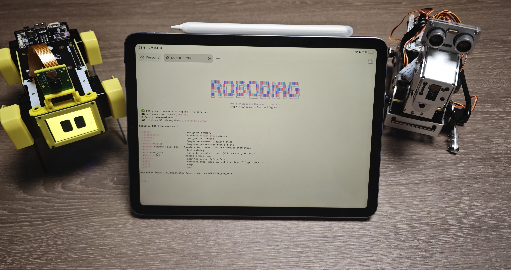

# RoboDiag Harness 🩺🤖

**A command-line tool for checking your robot's health and investigating problems.**

[](LICENSE)




Your robot is connected—but is it working properly? Is sensor data arriving?
Are there any reported faults? What should you check when something goes wrong?

RoboDiag brings robot checks, telemetry, and diagnostic tools into one terminal
interface.

Think of it as a robot checkup: **collect evidence, inspect problems, and decide
what to investigate next.**

## What can I use it for?

- **Check your robot** — inspect its status and available diagnostic information.
- **Inspect sensor readings** — view telemetry and collect samples over time.
- **Investigate problems** — examine reported faults and review previous results.
- **Run supported tests** — use the checks and actions available for your robot.
- **Give an AI assistant access to diagnostic tools** — let it work with robot
  data through the harness.

Available features depend on the robot, its software, and the selected
configuration.

## Who is it for?

Robot owners, students, and developers who want a more convenient way to inspect
and troubleshoot their robots.

You will need basic familiarity with a terminal. For the ROS 2 version, you also
need a working ROS 2 environment.

You do **not** need an AI assistant to use the command-line interface.

## What does “Harness” mean?

A harness connects tools together so they can be used through a common interface.

Here, it connects robot data, diagnostic checks, and supported actions—so you
can access them from one place.

## Getting started with ROS 2

### 1. Prepare your robot

Make sure:

- ROS 2 is installed.
- Your robot's ROS 2 software is running.
- The computer running RoboDiag can communicate with your robot.

The launcher looks for ROS 2 under `/opt/ros`. It uses the distribution
identified by `ROS_DISTRO` when available, otherwise it tries Humble.

### 2. Download the project

```bash
git clone https://github.com/YueBit/robodiag-harness.git
cd robodiag-harness
```

### 3. Start RoboDiag

```bash
bash ./robodiag
```

If your robot needs a workspace overlay, specify its location:

```bash
ROBODIAG_WS=~/robot_ws bash ./robodiag
```

The workspace should already be built, with an `install/setup.bash` file.

### 4. Start with a check

Begin with status checks and telemetry inspection. Review the available data
before running actions that move the robot.

Missing data does not necessarily mean broken hardware: the relevant sensor,
driver, or ROS 2 node may not be running.

## Configure your robot's interfaces

Robots may use different topic and service names. You can pass these to the
launcher:

```bash
bash ./robodiag \
  --cmd-vel-topic /cmd_vel \
  --estop-service /emergency_stop
```

Use the names provided by your robot's software. Specifying a name does not
create the corresponding topic or service.

## Using it with an AI assistant

An AI assistant can use diagnostic tools to collect information and help
interpret it.

A typical workflow is:

1. You describe the problem.
2. The assistant requests relevant robot data.
3. It reviews the results and suggests further checks.
4. You decide whether to proceed with any physical tests.

**AI suggestions can be wrong.** Check the underlying readings before acting on
a conclusion.

## Before running movement tests

Some actions can move real hardware.

- Place the robot in a clear, stable area.
- Keep people and obstacles away from moving parts.
- Know how to stop your robot independently of RoboDiag.
- Review the requested action before confirming it.

A software stop command depends on the robot's implementation and communication
connection. It does **not** replace a physical emergency stop.

## Limitations

RoboDiag helps gather and interpret diagnostic evidence. It cannot guarantee
that a robot is safe or identify every hardware fault.

The checks it can perform depend on the information and control interfaces your
robot exposes. Support for ROS 2 does not mean every ROS 2 robot works without
configuration.

---

## Features

- Inspect the ROS graph: nodes, topics, services and their types.
- Collect standard `/diagnostics` (`diagnostic_msgs/DiagnosticArray`).
- Inspect `ros2_control` through `controller_manager` services, when available.
- Snapshot/sample **any** discovered ROS 2 topic by loading its message type at
  runtime; nothing is hard-coded.
- Time-window sampling with `min/max/mean/std/range` statistics for jitter,
  drift, dropouts and intermittency.
- Deterministic health tests (`PASS / WARN / FAIL / SKIP`) persisted to SQLite.
- A fail-closed Safety Gate for motion-related operations.
- A software emergency stop (zero Twist + optional Trigger service).
- An OpenAI-compatible diagnostic agent (DeepSeek by default) with function
  calling.
- `rich` terminal UI with an animated banner and `/`-command completion.

## How it works

```
      natural language                         slash commands
            │                                        │
            ▼                                        ▼
   ┌──────────────────┐                    ┌──────────────────┐
   │   Agent loop     │                    │   REPL (rich)    │
   │  LLM function    │                    │  direct dispatch │
   │  calling, ≤10    │                    └────────┬─────────┘
   └────────┬─────────┘                             │
            │ tool calls                    same deterministic tools
            ▼                                        ▼
   ┌──────────────────────────────────────────────────────────┐
   │                 Deterministic tool layer                 │
   │   HarnessNode (rclpy)  ·  TestRunner  ·  HistoryStore     │
   └───────────┬───────────────────────┬──────────────────────┘
               │                       │
       ROS 2 graph / topics       SQLite test history
               │
       ┌───────┴────────┐
       │  Safety Gate   │  fail-closed, no LLM in the loop
       │  diagnostics / │  checks freshness + battery + joints
       │  battery /     │
       │  joint states  │
       └────────────────┘
```

The core rule:

> **The LLM may request evidence and tests, but deterministic code decides
> whether a write or motion operation is permitted.**

### How is this different from `ros2 doctor`?

`ros2 doctor` inspects the local ROS installation and its configuration. RoboDiag
Harness inspects the **live running graph and robot telemetry**, samples topics
over time, runs deterministic health tests, stores history, and adds an LLM agent
that can decide *which* evidence to collect next.

## Install with pip

`pip install` provides the `robodiag` console command. **rclpy and the ROS
message packages are not on PyPI** — they come from your ROS 2 distribution, so
source ROS before running.

```bash
# from PyPI (once published)
pip install robodiag-harness             # core (rich only)
pip install "robodiag-harness[all]"      # + prompt_toolkit completion + openai agent

# from source / editable
pip install -e ".[all]"
```

> ROS 2 Humble images ship setuptools < 61 and may have no PyPI access. In that
> case build with the system setuptools instead of an isolated one:
>
> ```bash
> pip install --user --no-build-isolation ".[all]"
> ```

### Dependencies

- ROS 2 (tested on Humble; mostly distro-agnostic), Python 3.10
- `rich` (required)
- `prompt_toolkit` (optional, live completion)
- `openai` (optional, AI agent)
- `ros-humble-controller-manager-msgs` (optional, for ros2_control checks)

## REPL commands

```
/graph                         ROS graph summary
/diagnostics                   Standard /diagnostics status
/control                       ros2_control status
/check                         Composite read-only health check
/topic <topic>                 Snapshot one message from a topic
/sample <topic> [sec] [Hz]     Sample a topic over time and compute statistics
/tests                         Test catalog
/run <test_id>                 Run a deterministic test (all read-only in v0.1)
/history [n]                   Recent n test runs
/safety                        Show the motion Safety Gate
/stop                          Software stop: zero cmd_vel + optional Trigger service
/help /quit
```

Any other input goes to the AI diagnostic agent (requires an API key).

### CLI flags

| Flag | Default | Purpose |
|---|---|---|
| `--controller-manager` | `/controller_manager` | controller_manager node namespace |
| `--cmd-vel-topic` | `/cmd_vel` | topic used by the software stop |
| `--estop-service` | *(none)* | optional `std_srvs/Trigger` E-stop service |
| `--db` | `~/.robodiag_ros2.db` | SQLite history path |
| `--model` | `deepseek-chat` | LLM model; overrides `DEEPSEEK_MODEL` |
| `--base-url` | `https://api.deepseek.com` | OpenAI-compatible base URL |
| `--api-key` | *(none)* | LLM API key (visible in `ps`/shell history) |
| `--api-key-file` | *(none)* | read the API key from a file (safer) |

## AI diagnostic agent

The agent runs a function-calling loop of at most 10 rounds. Each tool result is
fed back as structured JSON, and the final answer follows a fixed shape:
**symptom → evidence → root cause → recommendations**.

### Tools and risk layers

| Layer | Tool | What it does |
|---|---|---|
| Read-only | `inspect_graph` | Nodes, topics, services and types |
| Read-only | `get_diagnostics` | Cached standard `/diagnostics` statuses |
| Read-only | `inspect_ros2_control` | Controllers, hardware components, interfaces |
| Read-only | `get_topic_snapshot` | One message from any discovered topic |
| Read-only | `sample_topic` | Time-window sampling with statistics |
| Read-only | `list_tests` | Deterministic test catalog |
| Read-only | `run_test` | Run one deterministic health test |
| Read-only | `query_history` | Recent test runs from SQLite |
| Read-only | `check_motion_safety` | Run the deterministic Safety Gate |
| **Emergency** | `emergency_stop` | Software stop: zero Twist + optional Trigger service. **Never blocked.** |

v0.1 contains no write or motion tool, so there is nothing to confirm. When
motion extensions land, the Safety Gate and an explicit operator confirmation
will gate them.

### Configuration

The agent resolves its LLM settings with this precedence:

```
CLI flags  >  environment variables  >  ~/.robodiag.env  >  built-in defaults
```

`~/.robodiag.env`:

```bash
DEEPSEEK_API_KEY=sk-...
DEEPSEEK_BASE_URL=https://api.deepseek.com
DEEPSEEK_MODEL=deepseek-chat
```

One-off overrides, including non-DeepSeek providers (any OpenAI-compatible
endpoint):

```bash
./robodiag --model deepseek-reasoner
./robodiag --base-url https://dashscope.aliyuncs.com/compatible-mode/v1 --model qwen-max
./robodiag --api-key-file ~/.deepseek.key      # safer than --api-key
```

> `--api-key` works but is visible in `ps` and shell history. Prefer
> `DEEPSEEK_API_KEY` in `~/.robodiag.env` (mode `600`) or `--api-key-file`.

### Health thresholds

| Variable | Default | Meaning |
|---|---|---|
| `ROBODIAG_MIN_BATTERY_PCT` | `0.10` | minimum battery percentage for motion |
| `ROBODIAG_MIN_BATTERY_V` | `0.0` | minimum battery voltage for motion |
| `ROBODIAG_MAX_DIAG_AGE_S` | `5.0` | max age of `/diagnostics` before it is stale |
| `ROBODIAG_MAX_JOINT_STATE_AGE_S` | `1.0` | max age of `/joint_states` before it is stale |
| `ROBODIAG_DB` | `~/.robodiag_ros2.db` | SQLite history path |

## Test catalog

| `test_id` | Checks | Outcomes |
|---|---|---|
| `graph_health` | Node/topic counts; presence of `/joint_states` | `FAIL` if only the harness node is visible; `WARN` if `/joint_states` is missing |
| `diagnostics_health` | `/diagnostics` freshness and levels | `SKIP` if none received; `FAIL` on stale or ERROR/STALE; `WARN` on WARN |
| `joint_states_health` | Samples `/joint_states`: rate, finite values, named joints | `WARN` on low rate / few samples / missing positions |
| `ros2_control_health` | `controller_manager` controllers, hardware, interfaces | `SKIP` if unavailable; `FAIL` if hardware is not active |
| `system_health` | Composite of the four tests above | Worst sub-result |

Every run is written to SQLite and can be inspected with `/history` or the
`query_history` tool.

## Design principles

1. **Evidence before reasoning.** The agent must gather real telemetry; it may
   not invent hardware state from the robot model.
2. **Deterministic code decides writes.** The Safety Gate is plain code, is
   fail-closed, and distinguishes *unhealthy* evidence from *missing* evidence.
   "No data" is never treated as "normal".
3. **Structured results.** Evidence and tests are first-class objects
   (`Evidence`, `TestResult`), not free-form strings.

## Contributing

Bug reports, documentation improvements, and robot integrations are welcome.

When reporting an issue, please include:

- Your robot model and ROS 2 distribution.
- The command or check you ran.
- What you expected and what happened.
- Relevant logs, with credentials and private information removed.

The v0.1 test catalog is intentionally read-only; new tests should follow the
same rule — deterministic, structured evidence, and no motion without a Safety
Gate precondition.

## License

Apache License 2.0 — see [LICENSE](LICENSE).

ROS and ROS 2 are trademarks of Open Robotics. This project is not affiliated
with or endorsed by Open Robotics or Intrinsic.
