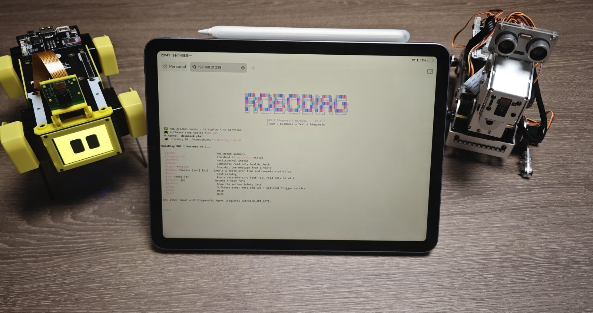
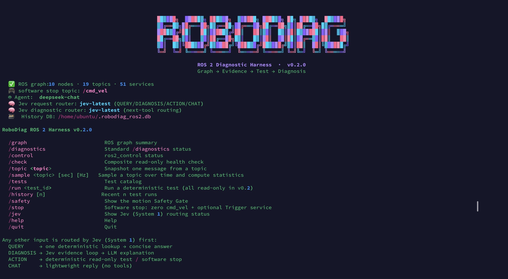

# RoboDiag Harness 🩺🤖

**A diagnostic harness for ROS 2 robots.**

[](LICENSE)




Your robot is connected. Is it actually healthy?

Is telemetry arriving at the expected rate? Are joints reporting valid values? Are controllers active? What evidence should you collect when something goes wrong?

RoboDiag brings robot telemetry, deterministic health checks, diagnostic history and AI-assisted investigation into one terminal interface.

The basic idea is simple:

```text
Robot → Evidence → Tests → Diagnosis
```

AI can help decide what to investigate and explain the evidence, but measured robot data and deterministic code remain the source of truth.

## What RoboDiag can do

RoboDiag can inspect the live ROS 2 graph, read standard diagnostics, sample arbitrary topics, run deterministic health tests and keep previous results in SQLite.

It also provides an optional diagnostic agent that can gather evidence through the same tools and explain what the evidence means.

Typical uses include:

* checking whether important robot interfaces are alive
* inspecting `/diagnostics`, joint states and controller status
* sampling sensor data over time
* investigating intermittent or unexpected behavior
* running repeatable health checks
* reviewing previous test results
* giving an AI assistant controlled access to diagnostic tools

You do not need an AI model to use the normal command-line interface.

## Robot Diagnostic Capability Description

Different robots expose different diagnostic information.

A mobile robot may expose battery state and `/cmd_vel`. A manipulator may use `ros2_control`. A quadruped may expose joint states, IMU and odometry but no battery telemetry through ROS.

RoboDiag uses **RDCD**, Robot Diagnostic Capability Description, to describe which diagnostic capabilities apply to a specific robot.

RDCD is authored by RoboDiag. The robot does not need to know anything about it.

For example, the current Mini Pupper 2 RDCD declares:

```yaml
capabilities:

  diagnostics:
    topic: /diagnostics
    message_type: diagnostic_msgs/msg/DiagnosticArray

  joint_states:
    topic: /joint_states
    message_type: sensor_msgs/msg/JointState

  imu:
    topic: /imu/data
    message_type: sensor_msgs/msg/Imu

  odometry:
    topic: /odom
    message_type: nav_msgs/msg/Odometry

  velocity_command:
    topic: /cmd_vel
    message_type: geometry_msgs/msg/Twist
```

There is no battery capability because Mini Pupper 2 does not currently expose battery telemetry to RoboDiag.

This distinction is important:

```text
Capability not declared
        ↓
Not supported for this robot
        ↓
Diagnostic test is N/A

Capability declared
        ↓
Expected at runtime
        ↓
Missing data is a diagnostic finding
```

For Mini Pupper 2, RoboDiag therefore does not search for battery telemetry as part of its normal RDCD-based diagnostic path, does not run battery health as an applicable test, and does not require battery evidence in the Safety Gate.

A battery test is shown as `N/A`, not as a fault.

Mini Pupper 2 is the first RDCD reference robot.

## Getting started

### 1. Prepare ROS 2

The simplest setup is to run RoboDiag on the same computer as the robot's ROS 2 software.

Make sure ROS 2 is installed and the robot nodes are running.

RoboDiag can also run on another machine. In that case, both machines need compatible ROS 2 environments and DDS discovery must work across the network.

`ROS_DOMAIN_ID` should match on both machines.

If your robot uses custom message packages, source its workspace before starting RoboDiag.

### 2. Clone the repository

```bash
git clone https://github.com/YueBit/robodiag-harness.git
cd robodiag-harness
```

### 3. Start RoboDiag

Generic ROS 2 mode:

```bash
bash ./robodiag
```

With a workspace overlay:

```bash
ROBODIAG_WS=~/robot_ws bash ./robodiag
```

With the Mini Pupper 2 RDCD:

```bash
bash ./robodiag --rdcd mini_pupper_2
```

You can also load an RDCD directly from a YAML file:

```bash
bash ./robodiag --rdcd path/to/robot.yaml
```

Without `--rdcd`, RoboDiag stays in generic mode and keeps the existing interface discovery behavior.

## Mini Pupper 2

Mini Pupper 2 is currently the first robot with a RoboDiag RDCD.

Its current diagnostic capabilities include:

| Capability | ROS 2 interface |
|---|---|
| Diagnostics | `/diagnostics` |
| Joint states | `/joint_states` |
| IMU | `/imu/data` |
| Odometry | `/odom` |
| Velocity command | `/cmd_vel` |
| Battery telemetry | Not supported |

Start RoboDiag with:

```bash
bash ./robodiag --rdcd mini_pupper_2
```

Then use:

```text
/rdcd
```

to inspect the active capability description.

The RDCD can also be switched at runtime without restarting:

```text
/rdcd mini_pupper_2
/rdcd path/to/other_robot.yaml
/rdcd off
```

`/rdcd off` returns to generic mode.

RoboDiag validates declared capabilities against the live ROS graph and reports states such as:

```text
AVAILABLE
MISSING
TYPE_MISMATCH
```

Capabilities that are not declared by the RDCD are considered not supported for that robot.

## REPL commands



```text
/graph                         ROS graph summary
/diagnostics                   Standard /diagnostics status
/control                       ros2_control status
/check                         Composite read-only health check
/topic <topic>                 Snapshot one message from a topic
/sample <topic> [sec] [Hz]     Sample a topic over time
/tests                         Test catalog
/run <test_id>                 Run a deterministic health test
/history [n]                   Recent test runs
/safety                        Show the motion Safety Gate
/stop                          Request a software stop
/rdcd [robot|path|off]         Show or switch the active RDCD
/jev                           Show Jev routing status
/help                          Help
/quit                          Quit
```

Any other input can be handled as natural language when the corresponding AI configuration is available.

Slash-command results are fed back into the next natural-language turn, so you
can run `/check` and then ask the agent about what it reported without
repeating yourself.

Examples:

```text
What is the battery level?

Are there any diagnostic errors?

Why are the joints behaving strangely?

Check whether the robot looks healthy.
```

## Deterministic health tests

RoboDiag currently includes these tests:

| Test | Purpose |
|---|---|
| `graph_health` | Check whether the ROS graph and core robot signals are present |
| `diagnostics_health` | Inspect standard `/diagnostics` status and freshness |
| `battery_health` | Check BatteryState percentage, voltage, freshness and validity |
| `joint_states_health` | Sample joint states and check rate, values and basic stream health |
| `ros2_control_health` | Inspect controllers, hardware and interfaces |
| `system_health` | Run the applicable tests and aggregate the result |

Normal test results are:

```text
PASS
WARN
FAIL
SKIP
```

When an RDCD is active, a test whose required capability is not declared is reported as:

```text
N/A
```

Internally this is `NOT_SUPPORTED`.

`N/A` does not reduce the overall system health result.

For example, Mini Pupper 2 does not declare battery or `ros2_control` capabilities, so those checks do not count against its health.

A declared capability that should exist but is missing at runtime is different. That remains a real diagnostic finding.

Every test run is stored in SQLite and can be reviewed with `/history`.

## Safety model

RoboDiag keeps diagnostic reasoning separate from action safety.

The main rule is:

> AI may request evidence and tests. Deterministic code decides what is true and what is allowed.

The Safety Gate runs in normal code and does not depend on an LLM.

Without an RDCD, the existing generic safety assumptions are used.

With an RDCD, only capabilities declared for that robot are part of the applicable safety evidence set.

For example:

```text
Mini Pupper 2 RDCD
    diagnostics      supported
    joint_states     supported
    battery          not supported
```

The Safety Gate therefore checks diagnostics and joint-state evidence, but does not block Mini Pupper 2 simply because battery telemetry is unavailable.

Missing evidence for a capability that is expected by the active robot configuration still fails closed.

`/stop` sends a software stop command through the configured velocity topic and can optionally call a `std_srvs/Trigger` service.

A software stop is not a replacement for a physical emergency stop.

## AI-assisted diagnosis

RoboDiag supports two diagnostic routing modes.

### Classic function calling

With an OpenAI-compatible model configured, the model can request read-only RoboDiag tools, inspect their results and produce a diagnosis.

DeepSeek is the default configuration, but other OpenAI-compatible endpoints can be used.

### Jev routing

When `TYPESAFE_API_KEY` is configured, Jev acts as a fast decision layer.

It handles two jobs:

```text
User request
    ↓
QUERY / DIAGNOSIS / ACTION / CHAT
```

For a diagnosis, Jev chooses which read-only evidence tool to call next. Once enough evidence has been collected, the LLM writes the final explanation.

The responsibilities stay separate:

| Component | Responsibility |
|---|---|
| Deterministic tools | Measure robot state |
| Jev | Decide what evidence to collect next |
| LLM | Explain the collected evidence |
| Safety Gate | Decide whether an action is permitted |

Jev does not execute motion or write operations.

## Diagnostic tools

| Tool | Purpose |
|---|---|
| `inspect_graph` | Inspect nodes, topics, services and types |
| `get_diagnostics` | Read cached standard diagnostics |
| `inspect_ros2_control` | Inspect controllers and hardware |
| `get_topic_snapshot` | Read one message from any discovered topic |
| `sample_topic` | Sample a topic over a time window |
| `list_tests` | List deterministic health tests |
| `run_test` | Run one health test |
| `query_history` | Read previous test results |
| `check_motion_safety` | Evaluate the deterministic Safety Gate |
| `emergency_stop` | Request the software stop path |

Tool results are returned as structured data rather than free-form text.

## Topic sampling

RoboDiag can dynamically load the message type of a discovered ROS 2 topic.

For example:

```text
/sample /joint_states 3 10
```

The sampler calculates numeric statistics such as:

```text
min
max
mean
std
range
```

This is useful when investigating sensor variation, intermittent behavior and changing telemetry.

The current sampling implementation is intended as diagnostic evidence collection rather than a high-frequency data acquisition system.

## Configuration

AI configuration follows this precedence:

```text
CLI flags
environment variables
~/.robodiag.env
built-in defaults
```

Example `~/.robodiag.env`:

```bash
DEEPSEEK_API_KEY=sk-...
DEEPSEEK_BASE_URL=https://api.deepseek.com
DEEPSEEK_MODEL=deepseek-chat

TYPESAFE_API_KEY=apikey_...
TYPESAFE_BASE_URL=https://api.typesafe.ai
TYPESAFE_MODEL=jev-latest
```

Examples:

```bash
./robodiag --model deepseek-reasoner

./robodiag \
  --base-url https://dashscope.aliyuncs.com/compatible-mode/v1 \
  --model qwen-max

./robodiag --api-key-file ~/.deepseek.key
```

Using `--api-key` or `--jev-api-key` directly can expose the key through shell history or process listings. Environment variables, `~/.robodiag.env`, or key files are safer.

## CLI options

| Option | Default | Purpose |
|---|---|---|
| `--rdcd` | none | Robot ID or RDCD YAML path |
| `--controller-manager` | `/controller_manager` | ros2_control manager namespace |
| `--cmd-vel-topic` | `/cmd_vel` | Fallback software-stop Twist topic |
| `--estop-service` | none | Optional Trigger stop service |
| `--db` | `~/.robodiag_ros2.db` | SQLite history path |
| `--model` | `deepseek-chat` | LLM model |
| `--base-url` | `https://api.deepseek.com` | OpenAI-compatible endpoint |
| `--api-key-file` | none | Read LLM API key from a file |
| `--jev-model` | `jev-latest` | Jev model |
| `--jev-base-url` | `https://api.typesafe.ai` | TypeSafe endpoint |
| `--jev-api-key-file` | none | Read TypeSafe key from a file |

## Health thresholds

| Variable | Default | Purpose |
|---|---|---|
| `ROBODIAG_MIN_BATTERY_PCT` | `0.10` | Minimum battery percentage when battery is applicable |
| `ROBODIAG_MIN_BATTERY_V` | `0.0` | Minimum battery voltage when configured |
| `ROBODIAG_MAX_DIAG_AGE_S` | `5.0` | Maximum diagnostics age |
| `ROBODIAG_MAX_BATTERY_AGE_S` | `5.0` | Maximum battery-state age |
| `ROBODIAG_MAX_JOINT_STATE_AGE_S` | `1.0` | Maximum joint-state age |
| `ROBODIAG_DB` | `~/.robodiag_ros2.db` | History database |

## How it works

```text
                    user
                     │
          ┌──────────┴──────────┐
          │                     │
    natural language        REPL commands
          │                     │
          ▼                     ▼
    request routing       direct dispatch
          │                     │
          └──────────┬──────────┘
                     ▼
          deterministic tool layer
                     │
          ┌──────────┼───────────┐
          │          │           │
       tests      history    Safety Gate
          │                      │
          └──────────┬───────────┘
                     │
                    RDCD
              when configured
                     │
                     ▼
                ROS 2 robot
```

RDCD determines which robot capabilities are applicable.

The ROS graph provides the actual runtime evidence.

The test layer evaluates that evidence.

AI sits above the deterministic tools and does not replace them.

## Project structure

| File | Purpose | ROS required? |
|---|---|---|
| `robodiag_ros2.py` | ROS node, CLI, REPL, topic tools, AI integration | Yes |
| `robodiag_core.py` | Test runner, history, Safety Gate, deterministic core | No |
| `robodiag_rdcd.py` | RDCD loading, validation and capability status | No |
| `robodiag_jev.py` | Jev routing and diagnostic state | No |
| `robodiag` | Launcher | Shell / ROS environment |
| `rdcd/mini_pupper_2.yaml` | First robot-specific RDCD | No |

The deterministic core, RDCD logic and Jev routing can all be tested without a running ROS environment.

## Installation with pip

`rclpy` and ROS message packages are provided by the ROS 2 installation rather than PyPI.

From source:

```bash
pip install -e ".[all]"
```

For ROS 2 Humble environments using an older system `setuptools`:

```bash
pip install --user --no-build-isolation ".[all]"
```

Once the package is published to PyPI, the intended installation is:

```bash
pip install robodiag-harness
```

or:

```bash
pip install "robodiag-harness[all]"
```

### Dependencies

| Dependency | Purpose |
|---|---|
| ROS 2 Humble | Current tested ROS environment |
| Python 3.10 | Runtime |
| `rich` | Terminal UI |
| `prompt_toolkit` | Optional command completion |
| `openai` | Optional AI agent |
| `controller_manager_msgs` | Optional ros2_control inspection |

## Testing

The core test suite can run without ROS 2 or API keys.

```bash
python3 -m unittest test_core
python3 -m unittest test_rdcd
python3 test_jev.py
python3 test_request_router.py
```

`test_core.py` covers the deterministic test runner, history and Safety Gate.

`test_rdcd.py` covers RDCD loading, capability applicability, runtime availability, `NOT_SUPPORTED` behavior, system-health aggregation and RDCD-aware SafetyGate behavior.

`test_jev.py` contains offline routing checks and optional live TypeSafe tests.

`test_request_router.py` tests request classification and language handling.

## Design principles

**Evidence before reasoning**

Robot state should come from measured telemetry, not assumptions made by an AI model.

**Robot-specific applicability**

A missing capability and an unsupported capability are not the same thing. RDCD defines what RoboDiag should expect from a particular robot.

**Deterministic diagnostics**

Health tests return structured results based on measured evidence.

**Deterministic safety**

AI can request information, but it does not decide whether a motion or write operation is safe.

**Generic robot access where possible**

RoboDiag can inspect arbitrary ROS topics without an RDCD. RDCD adds robot-specific diagnostic knowledge on top of that generic capability.

## Current limitations

RoboDiag is an experimental diagnostic harness, not a certified robot safety system.

The first RDCD currently targets Mini Pupper 2. Supporting additional robot families will require additional RoboDiag-authored capability descriptions and, where necessary, support for their interfaces.

The current software stop depends on the robot's ROS implementation and communication path.

Health checks can only evaluate information the robot makes observable.

AI-generated explanations may be wrong. Always review the underlying evidence.

## Future direction

RDCD is intended to separate robot-specific diagnostic knowledge from the generic RoboDiag runtime.

The long-term model is:

```text
Mini Pupper 2 + Mini Pupper RDCD
                │
                ▼
          RoboDiag Harness

Future robot + its RDCD
                │
                ▼
        same RoboDiag Harness
```

The RDCD schema is still experimental. Mini Pupper 2 is the first implementation and will be used to learn what belongs in the description before the format is generalized further.

## Contributing

Bug reports, documentation improvements, diagnostic tests and robot integrations are welcome.

When reporting an issue, include the robot model, ROS 2 distribution, the command you ran, the expected behavior and relevant logs.

Please remove credentials or private information from logs before posting them.

## License

Apache License 2.0. See [LICENSE](LICENSE).

ROS and ROS 2 are trademarks of Open Robotics. This project is not affiliated with or endorsed by Open Robotics or Intrinsic.
